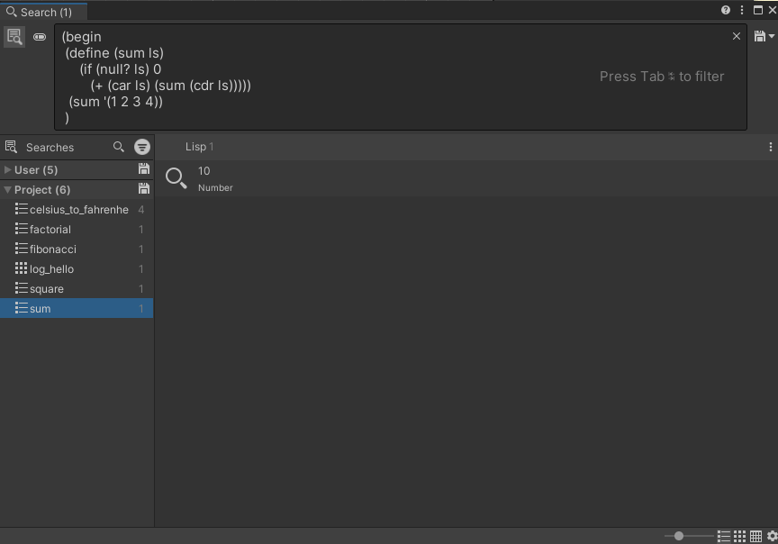
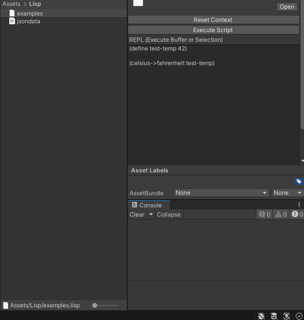

# UniLisp

Basic Lisp interpreter made to work in C# and created with a small Unity integration.

## Inspiration
UniLisp is heavily inspired by the 2 lispy articles by Peter Norvig:

- [How to write a Lisp Interpreter in Python](http://norvig.com/lispy.html)
- [An even better Lisp Interpreter in Python](https://norvig.com/lispy2.html)

## Demo video

I created this small [tongue and cheek video](https://www.youtube.com/watch?v=RAubH8t0pGw) to present UniLisp to Unity Hackweek crowd.

I hope you appreciate the 2001, Space Odyssey soundtrack!

## Features
UniLisp supports :

- Basic types: number (without boxing), string, symbol and List.
- Macro system
- An operator (#) to access any `public static` C# functions.
- Allows user to register C# function and C# Macros

### Unity Integration

UniLisp also has a `SearchProvider` that integrates with Unity Search Window and that act as a semi-REPL. The sample project contains a bunch of Unity Search Queries that encapsulate lisp snippets.

UniLisp also has a really simple Inspector for `.lisp` files. This Inspector allows to execute the script or to execute arbitrary snippets of lisp. The resulting statements are printed in the Console Window.

